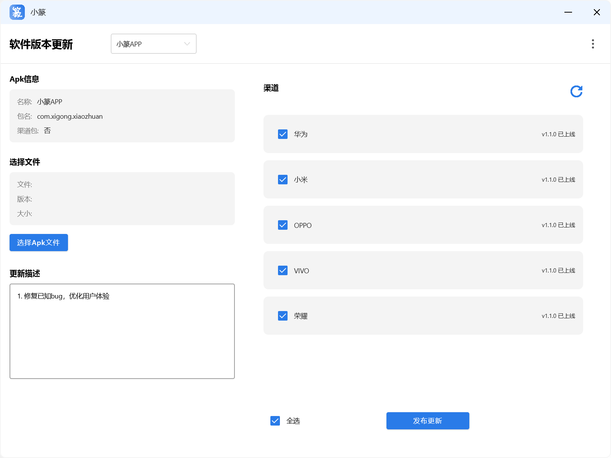
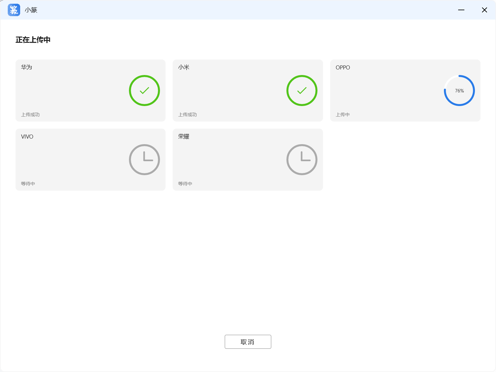
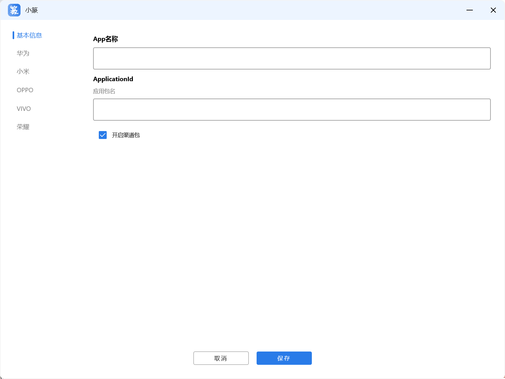
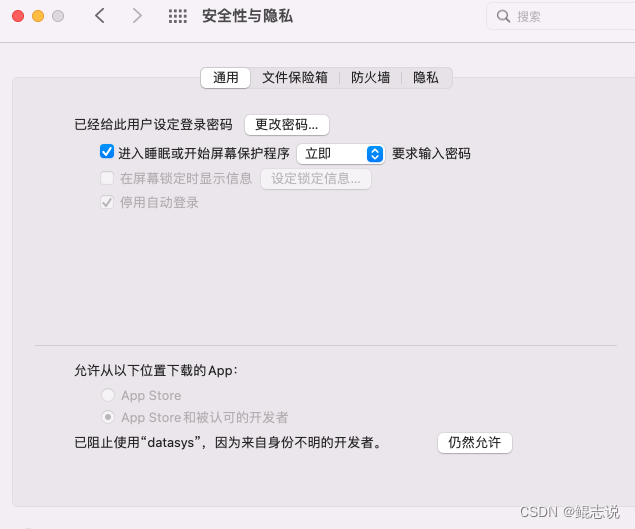

# 小蜜蜂传包  

一键上传Apk到多个应用市场，开源，免费

<a href="./doc/ENGLISH.md">English README</a>

## 应用界面截图

### 1. 首页

### 2. 提交新版本页面

### 3. 新增APP页面

## 特点：

1. 使用应用市场提供的Api传包功能，安全，稳定，快捷
2. 代码开源，完全免费，不会向第三方上传任何相关账号信息
3. 基于Compose Desktop 开发，支持Windows 和Mac OS

## 如何使用
<a href="./doc/Instructions.md">点击这里查看功能文档</a>

## 安装包下载
Windows 是绿色版，下载解压后，直接启动

Mac 版本未签名，需要配置以后才可以打开

1. 点击屏幕左上角的苹果图标，选择菜单：找到系统偏好设置
2. 打开系统偏好设置界面，点击"安全性与隐私"-“通用”
3. 窗口底部允许从以下位置下载的App会看到：已阻止使用“XXX”，因为来自身份不明的开发者。点击后面的"仍要打开"按钮
4. 在弹出的确认弹窗中，点击"打开"按钮即可
   

<a href="https://gitee.com/xigong93/XiaoZhuan/releases">从Gitee下载(推荐)</a>

<a href="https://github.com/dxmwl/new_bee_upload_app/releases">从Github下载</a>

## 功能限制

1. 仅支持华为、小米、OPPO、VIVO、荣耀 5个应用市场
2. 仅支持32位和64位合并版包，暂不支持分包上传
3. 仅支持更新已上架的APP，不支持新增APP

## 自己编译
<a href="./doc/Develop.md">请点击这里查看开发文档</a>

## 常见问题的解决

<a href="./doc/TroubleShotting.md">点击这里查看常见问题</a>

## 已知问题
1. 小米的传包Api不显示当前审核的版本，只返回线上的最新版本

2. OPPO 提交新版本后，有几分钟的延迟，过几分钟后才会显示新版本正在审核中

3. VIVO应用市场获取应用审核状态，有时候会报错，原因是此接口限制请求频率，每分钟不得超过3次

## 问题反馈
<a href="./issues">点击这里反馈问题</a>

#### 作者的其他项目
- [友你](https://sj.qq.com/appdetail/com.youni.mobile) 友你是一款征婚交友APP,在这里,你可以把你的真实信息登记下来,系统会根据您的信息,为您匹配最合适的TA,友你集交友、恋爱于一身，通过在线匹配，解决陌生人社交破冰难题，打造更真实的恋爱社区。
- [友圈](https://sj.qq.com/appdetail/com.youquan.mobile) 友圈是一款基于圈子交友的社区交友软件，被广大年轻人所青睐，在这里有着你所感兴趣的方方面面，应用内拥有生活、游戏、元宇宙、二次元、娱乐、绘画、设计、文学、时尚等多个领域，上千种兴趣标签，给你丰富的吐槽空间，在这里你可以吐槽生活中的不愉快，也可以针对时事新闻发表自己的观点。
- [一木林](https://sj.qq.com/appdetail/com.yimulin.mobile) 这是一款多功能工具类应用，因为 一木林 体积十分小巧而功能却又非常的完善强大，使它风评很高。
- [天天省钱](https://sj.qq.com/appdetail/com.ttsq.mobile) 优惠券，优惠劵，优惠，淘宝优惠券，返利优惠券，返利网，拼多多优惠券，饿了么红包，外卖红包优惠劵，淘趣购物返利优惠券，省钱就选天天省钱。 专注于淘宝优惠券的购物APP，超级折扣超级优惠，省钱20%以上。
- [青果短剧（已开源）](https://github.com/dxmwl/qg_android) 这是一个免费观看短剧、短视频的开源项目，供大家免费学习使用
- [小蜜蜂传包（已开源）](https://github.com/dxmwl/new_bee_upload_app) 一键上传Apk到多个应用市场，开源，免费

#### 联系开发者
欢迎加入开发者交流群，可加我微信:dxmcpjl,加好友备注"小蜜蜂传包",否则可能无法添加好友,如果本项目对您的业务有所帮助，欢迎对本项目进行资助，我将对本项目进行持续维护

|  |  |   |
|---------------------------------------------------------|---------------------------------------------------|---|

## 写在最后
本项目基于[小篆传包](https://github.com/xigong93/XiaoZhuan)进行开发  
撸码不易，欢迎点赞对我进行鼓励，点赞越多，优化越快